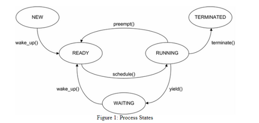
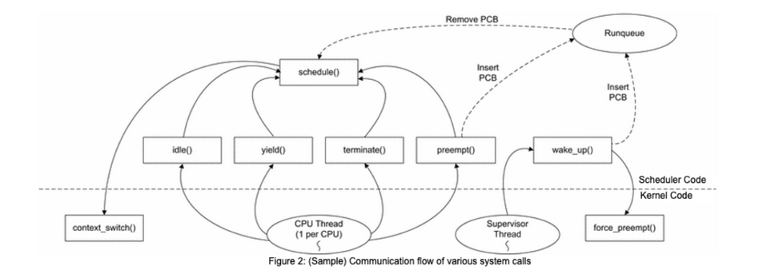

# OS_Project

## Project :

You are required to implement a multiprocessor operating system kernel “SparkKernel” with a
scheduler.

## Objective

- To build a kernel of a simple operating system
- To learn more about operating systems in general and process schedulers in specific.
- To use threads to learn about multi-threading and synchronization.

## Description

In this project, you will implement a simple Multithreaded kernel “SparkKernel” with a
scheduler. This kernel would be able to RUN simulated processes and threads. “SparkKernel”
must be implemented using below code structure
- os-kernel.c - Code for the operating system kernel which calls CPU scheduler and other OS
features.

- os-kernel.h - Header file for the operating system kernel.
- process.c - Descriptions of the simulated processes.
- process.h - Header file for the process data.- scheduler.c - This file contains functions for CPU scheduler.
- scheduler.h - Header file for code to interface with the OS kernel

Here are the **general requirements** for SparkKernel:

- Kernel can run process and threads
- Processes follows the five-state model, and is also depicted in the Figure
  - NEW - The process is being created and has not yet begun executing.
  - READY - The process is ready to execute and is waiting to be scheduled on a CPU.
  - RUNNING - The process is currently executing on a CPU.
  - WAITING - The process has temporarily stopped executing and is waiting on an I/O request to complete.
  - TERMINATED - The process has completed.

    
- Initialize processes and threads including their stack and related kernel data structures.
- There is a field named state in the PCB, which must be updated with the current state of the process. “SparkKernel” will use this field to collect statistics

### OS Kernel [40 marks]

You are required to use pthreads to replicate our “SparkKernel” on a multiprocessor computer as
below:

1.  One thread per CPU and one thread as a "controller" for our replication will be used.
2.  The CPU threads will simulate the currently running processes on each CPU, and the
    controller thread will print output and dispatch events to the CPU threads.
3.  CPU scheduler must be thread-safe as the code you write will be called from multiple
    threads. This means that all data structures must be protected using mutexes.
4.  The number of CPUs is specified as a command-line parameter to the kernel. This kernel
    can run on single core, dual core and quad code processors (1,2 and 4 CPUs).For example

        `os-kernel <Input file> <# CPUs> r <timeslice> <Output file>`

        e.g.

        `os-kernel processes.txt 1 r 4 results.txt`

        should run a Round-Robin scheduler with timeslices of 400 ms on a single CPU

        `os-kernel <Input file> <# of CPUs> f <Output file>`

        e.g. `os-kernel processes txt 2 f results.txt`

        should continue to run a FCFS scheduler on 2 CPUs.

        `os-kernel <Input file> <# CPUs> p <Output file>`

        e.g

        `os-kernel processes.txt 4 p results.txt`

        should run a Priority scheduler on 4 CPUS.

    Note: The input file is given by the user as per the format given in sample Processes1.txt &
    Processes2.txt. The output will be written in user-given output file name. The output also
    needs to be shown on the terminal besides writing to the optional output file

5.  Implement \_start() function to initialize the processes and threads you wish to run. Once the
    required information has been recorded in the appropriate data structures you will need to
    start the first process or thread. Once a process is started, it will run until it gives up
    execution by calling terminate().
6.  The scheduler than decides what process/thread to run next. This process is executed as a
    return from its terminate()call

### Scheduler:[60 marks]

1. Implement schedule() function as is the core function of the CPU scheduler. It is invoked
   whenever a CPU becomes available for running a process. schedule() must search the ready
   queue, select a runnable process, and call the context_switch() function to switch the process
   onto the CPU.
2. schedule() should extract the first process in the ready queue, then call context_switch() to
   select the process to execute. If there are no runnable processes, schedule() should
   call context_switch() with a NULL pointer as the PCB to execute the idle process.
3. There is a special process, the idle process, which is scheduled whenever there are no
   processes in the READY state.
4. There are four events which will cause the simulator to invoke schedule():Also refer to figure
   1 above for the details of these events.
5. yield() - A process completes its CPU operations and yields the processor to perform an I/O
   request.
6. wake_up() - A process that previously yielded completes its I/O request, and is ready to
   perform CPU operations. wake_up() is also called when a process in the NEW state becomes
   runnable.
7. preempt() - When using a Round-Robin or Static Priority scheduling algorithm, a CPU-bound
   process may be preempted before it completes its CPU operations.
8. terminate() - A process exits or is killed.
9. The CPU scheduler also contains one other important function: idle(). idle() contains the code
   that gets by the idle process. In the real world, the idle process puts the processor in a low-
   power mode and waits. For our OS kernel, you will use a pthread condition variable to block
   the thread until a process enters the ready queue. Therefore, Implement idle(). idle() must
   wait on a condition variable.
10. On most systems, there are a large number of processes, but only one or two CPUs on which
    to execute them. When there are more processes ready to execute than CPUs, processes must
    wait in the READY state until a CPU becomes available. To keep track of the processes
    waiting to execute, we keep a ready queue of the processes in the READY state.
11. Implement a thread-safe ready queue using a linked list. A linked list will help to reuse this
    ready queue for the Round-Robin and Preemptive Priority scheduling algorithms.

Figure shows a sample communication flow of various system calls as discussed above.

Since the ready queue is accessed by multiple processors, which may add and remove processes from
the ready queue, the ready queue must be protected by some form of synchronization for this project,
it will be a mutex lock (you may use mutexes or Semaphores to achieve the functionality). Three
CPU scheduling algorithms will be implemented in the scheduler:

1. First-Come, First Served (FCFS)
2. Round-Robin
3. Preemptive Priority

For each scheduling algorithm, Run SparkKernel simulation with 1, 2, and 4 CPUs and measure

- Running time of a process/thread
- Total number of context switches
- Time spent in the ready state

### FCFS Scheduler

Implement the CPU scheduler using the FCFS scheduling algorithm the following
recommendations:

- Be sure to update the state field of the PCB. The scheduler will read this field to generate the
  Running, Ready, and Waiting columns, and to generate the statistics for the output.
- There is a field in the PCB, next, which you may use to build linked lists of PCBs.
- Four of the five entry points into the scheduler (idle(), yield(), terminate(), and preempt())
  should cause a new process to be scheduled on the CPU. In your handlers, be sure to
  call schedule(), which will select a runnable process, and then call context_switch(). When
  these four functions return, the library will simulate the process selected by context_switch().
- context_switch() takes a timeslice parameter, which is used for preemptive scheduling
  algorithms. Since FCFS is non-preemptive, use -1 for this parameter to give the process an
  infinite timeslice.

### Round-Robin Scheduler

Implement the CPU scheduler using the Round-Robin scheduling algorithm the following
recommendations:

- Add Round-Robin scheduling functionality where timeslices are measured in tenths of
  seconds.
- To specify a timeslice when scheduling a process, use the timeslice parameter of
  context_switch(). The simulator will automatically preempt the process and call preempt()if
  the process executes on the CPU for the length of the timeslice without terminating or yielding of I/O.

### Priority Scheduling

Implement the CPU scheduler using the Priority scheduling algorithm the following
recommendations:

- Add Static Priority scheduling functionality where scheduler should use the priority specified
  in the static_priority field of the PCB. This priority is a value from 0 to 10, with 0 being the
  lowest priority and 10 being the highest priority. Lower-priority processes may be preempted
  if a process with a higher priority becomes runnable.
- For Static Priority scheduling, you need to make use of the current[ ] array
  and force_preempt() function. - The current[ ] array should be used to keep track of the process currently executing on each CPU. Since this array is accessed by multiple CPU threads, it must be protected by a mutex. current_mutex has been provided for you. - The force_preempt() function preempts a running process before its timeslice expires. Your wake_up() handler should make use of this function to preempt a lower priority process when a higher priority process needs a CPU.

### Input

For this simulation, we will use a series of different processes (as given in the input file.
Processes1.txt and Processes2.txt sample file depicting the table below is attached alongwith the
project description file).

For the example below there are five CPU-bound and three I/O-bound. For
simplicity, we have labelled each starting with a "C" or "I" to indicate CPU-bound or I/O-bound.
Here, the meaning of CPU-bound processes means that they will never go for I/O whereas I/O
bound process will go for I/O multiple times in its execution. Each process will be blocked in I/O
for 2 sec.

[Processes1.txt](Processes1.txt)

In Processes1.txt sample file, two extra columns of CPU burst, and I/O interval is added.
The first column indicates the total CPU burst the process/thread will require. Whereas the
second column indicates the CPU burst time after which I/O bound process will go for an
I/O (a positive value). For CPU bound processes, this value is -1 - indicating these processes will never go for I/O.

[Processes2.txt](Processes2.txt)

In Processes2.txt sample file, there are no extra columns for CPU burst and I/O time. This
means a more realistic scenario as a scheduler does not have advance knowledge of the
length of each CPU burst. Similarly, I/O bound process can go for I/O after using CPU for a
short interval. As the CPU burst times are not given in the file, the processes will end
execution after a random interval.

- The Processes1.txt sample file (and similar files like this) will be used as a test file to
  check correctness of each scheduling algorithm (using only one CPU).
- The Processes2.txt sample file (and similar files like this) will be checked to see how
  you handle the realistic scenario.

### Output

The SparkKernel generates a Gantt Chart, showing the current state of the OS at every 100ms interval.
The leftmost column shows the current time, in seconds. The next three columns show the number of
Running, Ready, and Waiting processes, respectively. The next two columns show the process
currently running on each CPU. The rightmost column shows the processes which are currently in
the I/O queue, with the head of the queue on the left and the tail of the queue on the right. Compile
and run the simulator with os-kernel processes.txt 2 will display the output below:

As nothing is executing. This is because we have no CPU scheduler to select processes to execute.
Now execute code with os-kernel processes.txt 1 f and below sample output should be displayed
(Note: This is just a sample output and not a correct one). Your algorithm should produce correct
one according to the given scheduler algorithm :
